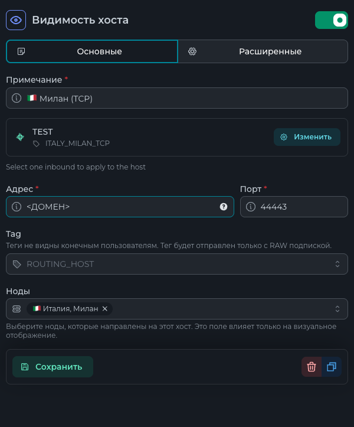
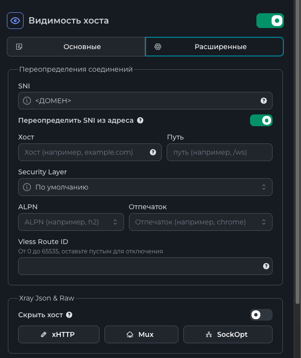
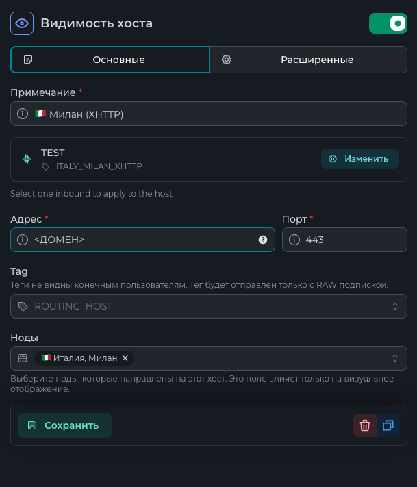
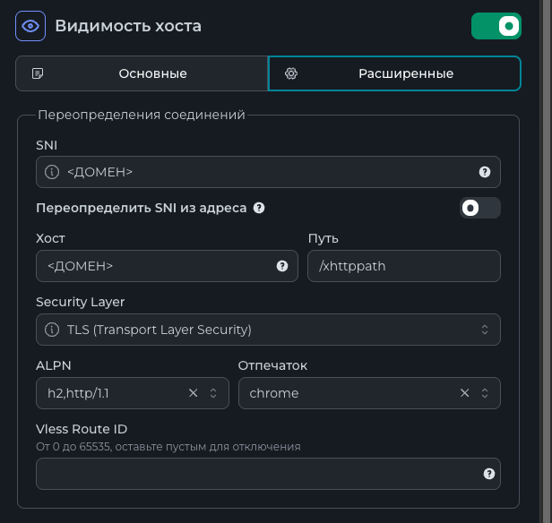
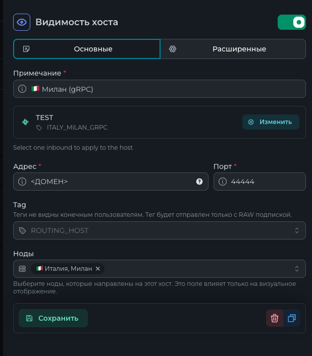
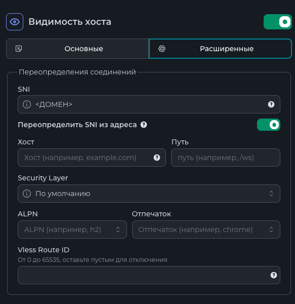

# Интро
Тут описана настройка сервера ноды + хостов, для того чтобы на ней работал конфиг с тремя инбаундами:
1. VLESS TCP Reality
2. VLESS xHTTP
3. VLESS gRPC

На домене реализована заглушка, чтобы это дерьмо выглядело как человеческий сайт.
## Важно блять
Я ебал ваши иксреи нахуй, однако данный сетап умудряется работать.
Не отрицаю, что gRPC инбаунд может быть реализован вообще не верно, но он работает - так что и похуй.

Если я хуйню тут какую-то написал, то не стесняйтесь кидать в меня говно и контрибутить.

# Настройка всего говнища
## Настройка файрволла
```
ufw allow OpenSSH && ufw allow 2222/tcp && ufw allow 80/tcp && ufw allow 443/tcp && ufw allow 9443/tcp && ufw allow 44443/tcp && ufw allow 44444/tcp && ufw disable && ufw enable
```

## Запрет ICMP запросов

```
nano /etc/ufw/before.rules
```

В блоке `# ok icmp codes for INPUT` меняем на
```
-A ufw-before-input -p icmp --icmp-type destination-unreachable -j DROP
-A ufw-before-input -p icmp --icmp-type time-exceeded -j DROP
-A ufw-before-input -p icmp --icmp-type parameter-problem -j DROP
-A ufw-before-input -p icmp --icmp-type echo-request -j DROP
-A ufw-before-input -p icmp --icmp-type source-quench -j DROP
```

В блоке `# ok icmp codes for FORWARD` меняем на
```
-A ufw-before-forward -p icmp --icmp-type destination-unreachable -j DROP
-A ufw-before-forward -p icmp --icmp-type time-exceeded -j DROP
-A ufw-before-forward -p icmp --icmp-type parameter-problem -j DROP
-A ufw-before-forward -p icmp --icmp-type echo-request -j DROP
```

Перезапуск файрволла

```
ufw disable && ufw enable
```

## Установка nginx
`sudo apt install curl gnupg2 ca-certificates lsb-release ubuntu-keyring`
```
curl https://nginx.org/keys/nginx_signing.key | gpg --dearmor \
    | sudo tee /usr/share/keyrings/nginx-archive-keyring.gpg >/dev/null
```

```
gpg --dry-run --quiet --no-keyring --import --import-options import-show /usr/share/keyrings/nginx-archive-keyring.gpg
```

```
echo "deb [signed-by=/usr/share/keyrings/nginx-archive-keyring.gpg] \
http://nginx.org/packages/mainline/ubuntu `lsb_release -cs` nginx" \
    | sudo tee /etc/apt/sources.list.d/nginx.list
```

```
echo -e "Package: *\nPin: origin nginx.org\nPin: release o=nginx\nPin-Priority: 900\n" \
    | sudo tee /etc/apt/preferences.d/99nginx
```

```
sudo apt update
sudo apt install nginx
```

## Создание заглушки
```
mkdir -p /var/www/html/
```

```
nano /var/www/html/index.html
```

Вставляем HTML-код заглушки
```html
<!DOCTYPE html>
<html>
    <head>
        <title>All good!</head>
    </head>
    <body>
        <h1>All good!</h1>
    </body>
</html>
```

## Генерация SSL для домена
```
sudo apt update
sudo apt install certbot python3-certbot-nginx
```
```
sudo certbot --nginx -d <ДОМЕН>
```

## Настройка nginx
```
nano /etc/nginx/conf.d/xray.conf
```

```
server {
    listen 443 ssl;
    http2 on;
    server_name <ДОМЕН>;

    ssl_certificate /etc/letsencrypt/live/<ДОМЕН>/fullchain.pem;
    ssl_certificate_key /etc/letsencrypt/live/<ДОМЕН>/privkey.pem;
    ssl_protocols TLSv1.2 TLSv1.3;

    root /var/www/html;
    index index.html;

    location / {
        try_files $uri $uri/ =404;
    }

    location /xhttppath/ {
        proxy_pass http://unix:/dev/shm/xrxh.socket;
        proxy_http_version 1.1;
        proxy_set_header Host $host;
        proxy_set_header X-Forwarded-For $proxy_add_x_forwarded_for;
        proxy_set_header Upgrade $http_upgrade;
        proxy_set_header Connection "upgrade";
    }
}

server {
    listen 9443 ssl;
    http2 on;
    server_name <ДОМЕН>;

    ssl_certificate /etc/letsencrypt/live/<ДОМЕН>/fullchain.pem;
    ssl_certificate_key /etc/letsencrypt/live/<ДОМЕН>/privkey.pem;
    ssl_protocols TLSv1.2 TLSv1.3;

    root /var/www/html;
    index index.html;
}

server {
    listen 80;
    http2 on;
    server_name <ДОМЕН>;

    location / {
        return 301 https://$host$request_uri;
    }
}
```

```
systemctl restart nginx
```

## Установка ноды
```
mkdir -p /opt/remnanode/
```
```
nano .env
```
```
NODE_PORT=2222
SECRET_KEY=<СЕКРЕТ ИЗ REMNAWAVE>
```
```
wget -O /opt/remnanode/geoip.dat https://github.com/Loyalsoldier/v2ray-rules-dat/releases/latest/download/geoip.dat
wget -O /opt/remnanode/geosite.dat https://github.com/Loyalsoldier/v2ray-rules-dat/releases/latest/download/geosite.dat
```
```
nano docker-compose.yml
```
```yml
services:
  remnanode:
    container_name: remnanode
    hostname: remnanode
    image: remnawave/node:latest
    network_mode: host
    restart: always
    volumes:
      - /dev/shm:/dev/shm
      - ./geoip.dat:/opt/remnanode/geopip.dat
      - ./geosite.dat:/opt/remnanode/geosite.dat
    env_file:
      - .env
```
```
curl -fsSL https://get.docker.com -o get-docker.sh
sh get-docker.sh
```
```
cd /opt/remnanode/
docker compose up
```

## Профиль remnawave
```json
{
  "log": {
    "loglevel": "info"
  },
  "dns": {
    "servers": [
      {
        "address": "94.140.14.14",
        "domains": [
          "geosite:geolocation-!cn"
        ]
      },
      {
        "address": "94.140.15.15",
        "domains": [
          "geosite:geolocation-!cn"
        ]
      }
    ]
  },
  "inbounds": [
    {
      "tag": "ITALY_MILAN_TCP",
      "port": 44443,
      "listen": "0.0.0.0",
      "protocol": "vless",
      "settings": {
        "clients": [],
        "decryption": "none"
      },
      "sniffing": {
        "enabled": true,
        "routeOnly": false,
        "destOverride": [
          "http",
          "tls",
          "quic",
          "fakedns"
        ],
        "metadataOnly": false
      },
      "streamSettings": {
        "network": "tcp",
        "security": "reality",
        "tcpSettings": {
          "header": {
            "type": "none"
          },
          "acceptProxyProtocol": false
        },
        "realitySettings": {
          "dest": "9443",
          "show": false,
          "xver": 0,
          "spiderX": "/",
          "shortIds": [
            ""
          ],
          "publicKey": "<ПУБЛИЧНЫЙ КЛЮЧ>",
          "privateKey": "<ПРИВАТНЫЙ КЛЮЧ>",
          "serverNames": [
            "<ДОМЕН>"
          ]
        }
      }
    },
    {
      "tag": "ITALY_MILAN_GRPC",
      "port": 44444,
      "listen": "0.0.0.0",
      "protocol": "vless",
      "settings": {
        "clients": [],
        "decryption": "none"
      },
      "sniffing": {
        "enabled": true,
        "routeOnly": false,
        "destOverride": [
          "http",
          "tls",
          "quic",
          "fakedns"
        ],
        "metadataOnly": false
      },
      "streamSettings": {
        "network": "grpc",
        "security": "reality",
        "tcpSettings": {
          "header": {
            "type": "none"
          },
          "acceptProxyProtocol": false
        },
        "realitySettings": {
          "dest": "9443",
          "show": false,
          "xver": 0,
          "spiderX": "/",
          "shortIds": [
            ""
          ],
          "publicKey": "<ПУБЛИЧНЫЙ КЛЮЧ>",
          "privateKey": "<ПРИВАТНЫЙ КЛЮЧ>",
          "serverNames": [
            "<ДОМЕН>"
          ]
        }
      }
    },
    {
      "tag": "ITALY_MILAN_XHTTP",
      "listen": "/dev/shm/xrxh.socket,0666",
      "protocol": "vless",
      "settings": {
        "clients": [],
        "fallbacks": [],
        "decryption": "none"
      },
      "sniffing": {
        "enabled": true,
        "destOverride": [
          "http",
          "tls",
          "quic"
        ]
      },
      "streamSettings": {
        "network": "xhttp",
        "xhttpSettings": {
          "mode": "auto",
          "path": "/xhttppath/",
          "extra": {
            "noSSEHeader": true,
            "xPaddingBytes": "100-1000",
            "scMaxBufferedPosts": 30,
            "scMaxEachPostBytes": 1000000,
            "scStreamUpServerSecs": "20-80"
          }
        }
      }
    }
  ],
  "outbounds": [
    {
      "tag": "DIRECT",
      "protocol": "freedom"
    },
    {
      "tag": "BLOCK",
      "protocol": "blackhole"
    }
  ],
  "routing": {
    "rules": [
      {
        "ip": [
          "ext:geoip.dat:ru"
        ],
        "type": "field",
        "outboundTag": "DIRECT"
      },
      {
        "type": "field",
        "protocol": [
          "bittorrent"
        ],
        "outboundTag": "BLOCK"
      }
    ],
    "domainStrategy": "IPIfNonMatch"
  }
}
```

## Настройки TCP хоста



## Настройки XHTTP хоста



Xray Json & Raw (xHTTP)
```json
{
  "xmux": {
    "cMaxReuseTimes": 0,
    "maxConcurrency": "16-32",
    "maxConnections": 0,
    "hKeepAlivePeriod": 0,
    "hMaxRequestTimes": "600-900",
    "hMaxReusableSecs": "1800-3000"
  },
  "noGRPCHeader": false,
  "xPaddingBytes": "100-1000",
  "downloadSettings": {
    "port": 443,
    "address": "<домен>",
    "network": "xhttp",
    "security": "tls",
    "tlsSettings": {
      "alpn": [
        "h2,http/1.1"
      ],
      "show": false,
      "serverName": "<домен>",
      "fingerprint": "chrome",
      "allowInsecure": false
    },
    "xhttpSettings": {
      "path": "/xhttppath/"
    }
  },
  "scMaxEachPostBytes": 1000000,
  "scMinPostsIntervalMs": 30,
  "scStreamUpServerSecs": "20-80"
}
```

## Настройки gRPC хоста

